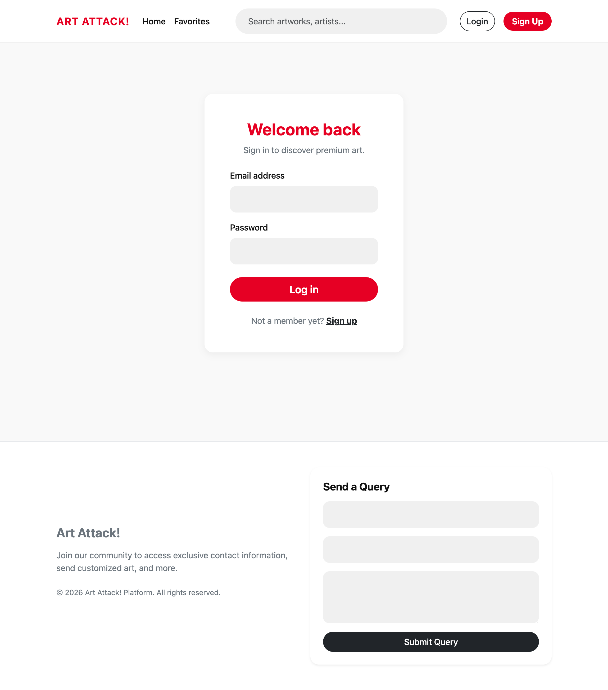
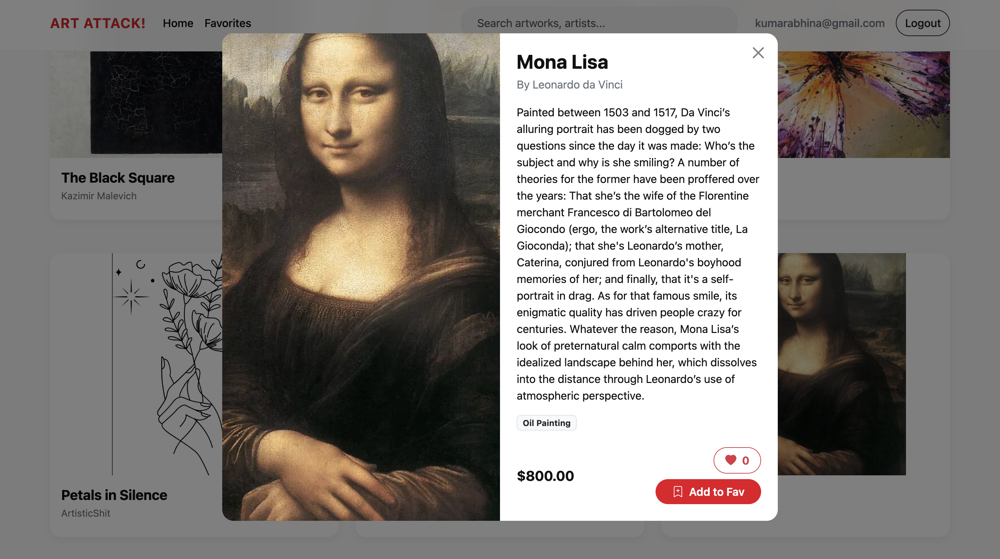
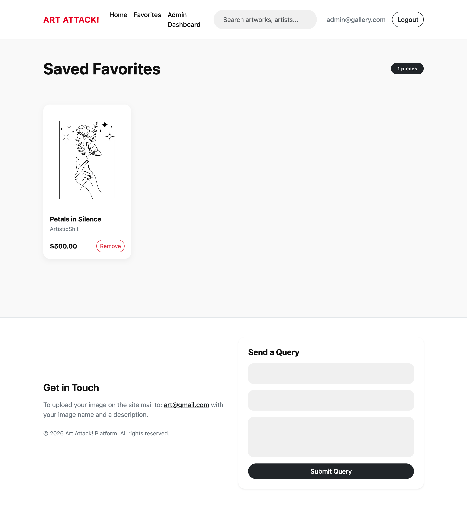
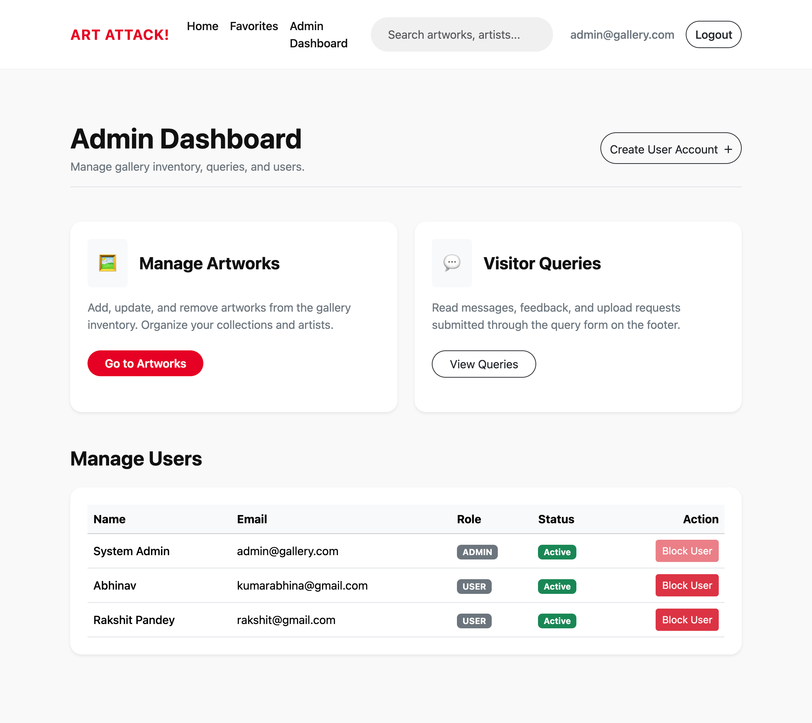
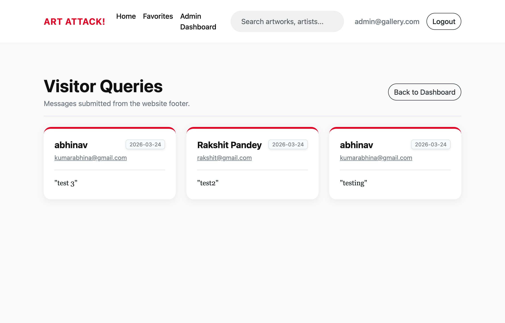
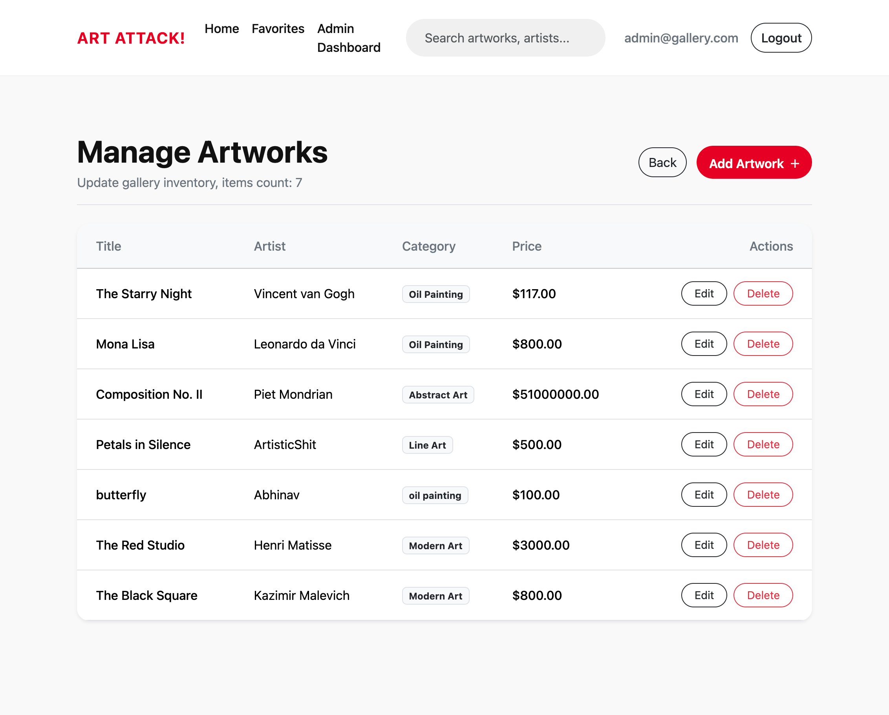
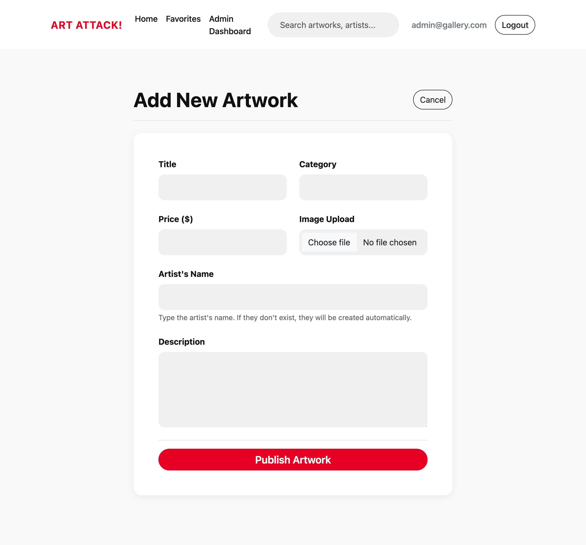

# 🎨 Art Attack! - Digital Art Gallery Platform

A production-grade, monolithic Spring Boot web application designed to serve as a digital art gallery. **Art Attack!** provides a beautiful, interactive platform for users to discover, like, and favorite curated artworks, while administrators can seamlessly manage the gallery's inventory and artist profiles.


## ✨ Key Features

### 👤 User Experience
* **Dynamic Gallery Floor:** A responsive, Masonry-style grid layout to perfectly showcase artworks of varying aspect ratios.
* **Smart Search & Pagination:** Fast, keyword-based search functionality with native pagination for optimal scalability and performance when browsing large collections.
* **Interactive Engagement:** 
   * A **Public Like Counter** allows visitors to express appreciation for pieces without logging in.
   * A dedicated **Favorites System** allows authenticated users to curate and save personal collections.
* **Modern UI/UX:** Styled with custom CSS and Bootstrap 5, featuring immersive hero carousels, glassmorphism elements, and smooth micro-animations.

### 🛡️ Admin & Security
* **Role-Based Authentication:** Secured by Spring Security, distinguishing between basic users and administrators.
* **Asset Management:** Administrators can dynamically upload physical image files (safely hosted and mapped via absolute server static paths).
* **Full CRUD Dashboard:** Manage the inventory, edit artwork details (price, categories), and update artist profiles seamlessly from the admin console.

## 🛠️ Technology Stack

* **Backend:** Java 19, Spring Boot 3
* **Security:** Spring Security (BCrypt Password Encoding)
* **Database:** MySQL, Spring Data JPA / Hibernate
* **Frontend:** HTML5, Vanilla CSS, Bootstrap 5, JSP (with JSTL core tags)
* **Build Tool:** Maven

## 🚀 Running the Project Locally

### Prerequisites
- **Java 17 or 19** installed
- **Maven** installed
- **MySQL** running locally

## Setup Steps

1. **Clone the repository**

2. **Configure the Database**

Open this `src/main/resources/application.properties`

Update the MySQL credentials with your local development environment details:

```properties
spring.datasource.url=jdbc:mysql://127.0.0.1:3306/art_gallery?createDatabaseIfNotExist=true
spring.datasource.username=YOUR_LOCAL_USERNAME
spring.datasource.password=YOUR_LOCAL_PASSWORD
```


3. **Compile and Run**  
Import the project into an IDE like Spring Tools Suite (Eclipse) or IntelliJ, update the Maven project, and run `ArtGalleryApplication.java`.

## 📸 Screenshots
### 👤 User Side
---------------------------------------------------------------------------------------------------------------------------------------------------------------
## Login Page

## User Home Page

## Post Preview

## Favourites Page


### 🛡️ Admin Side
---------------------------------------------------------------------------------------------------------------------------------------------------------------
## Admin Home Page

## Admin Dashboard

## Admin Queries

## Admin Manage Artworks

## Admin Add Artwork

